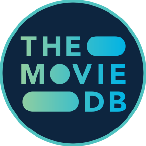

**My Life**: 🦐 Eat 💪 Exercise 🤖 Code 🎧 Music 🍿 Movies 😴 Sleep

I'm **_progressive as hell_** 🏳️‍🌈🏳️‍⚧️☮️♀️⚛️, so naturally I love arguing.

 

## My cinema taste:

I'm drawn towards **_realistic_** films that are **_visually stunning_**, **_emotionally charged_**, and **_mind-blowing_** in their storytelling. I love the depiction of **_loneliness_** in cinema, the beauty of **_romance_** and **_eroticism_**, and **_narratives_** that challenge how I see the world.

#### If you ask me what is cinema?

I say its a **_getaway car_** to escape from reality.

 

## Quotes that describe me:

**"I am no longer accepting the things I cannot change. I am changing the things I cannot accept."** — _Angela Davis: Portrait of a Revolutionary_ (1984)

**"I would rather be a free soul in a cage than a caged soul in a free world."** — _A Beautiful Mind_ (2001)

 

## Letterboxd tools I made:

#### [Letterboxd Custom Backdrops](https://github.com/Tetrax-10/letterboxd-custom-backdrops)

Userscript to customize letterboxd backdrops without letterboxd PATRON.

<video width="100%" autoplay muted loop controls>
    <source src="https://github.com/user-attachments/assets/2cb11c80-5b30-440d-ba17-c960e5adaf8b" type="video/mp4"/>
</video>

 

**Note:** My ratings and reviews are heavily influenced by my **mood**. A masterpiece might get a lower rating if I’m in a funk, while a mediocre flick could receive higher praise if it resonates with me emotionally at the right time.

## Connections

